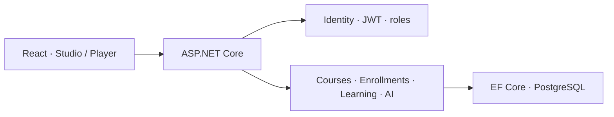

# DiwyLearn

### Creación de cursos y aprendizaje interactivo con una base preparada para crecer

[](https://dotnet.microsoft.com/) [](https://react.dev/) [](https://www.postgresql.org/) [](#alcance)

DiwyLearn permite que una misma cuenta aprenda, cree y gestione cursos. Conecta un Course Studio modular con una experiencia de estudiante que conserva progreso, borradores y entregas.

> Este repositorio contiene documentación, arquitectura, ejemplos y componentes públicos. El código principal permanece privado porque el producto continúa en desarrollo.

## Problema y enfoque

Muchas plataformas separan artificialmente estudiante y creador o reducen el aprendizaje a contenido pasivo. DiwyLearn modela cursos y bloques interactivos, aplica permisos por rol/propiedad y hace trazable el ciclo creación → aprendizaje → revisión.

## Mi responsabilidad

Desarrollo full-stack: producto, API .NET, contratos HTTP, EF Core, autenticación/roles, Course Studio, experiencia React y endurecimiento de seguridad.

## Capacidades demostradas

- Identity y JWT Bearer con roles `Student`, `Creator` y `Admin`.
- Autorización por rol y ownership de curso.
- Vertical slices, DTO explícitos y errores uniformes.
- EF Core + PostgreSQL con 10 migraciones principales.
- Sanitización server-side, sandbox de embeds y rate limiting.
- Proyecciones SQL para catálogos y progreso real.
- React 19, TipTap, dnd-kit e i18n en cinco idiomas.

## Arquitectura



Lee [arquitectura](./docs/architecture.md), [decisiones](./docs/decisions.md) y [roadmap](./docs/roadmap.md).

## Muestra pública

`CourseAccessPolicy` separa rol, propiedad, publicación e inscripción y devuelve un motivo estable para auditoría o UI.

```bash
dotnet test tests/DiwyLearn.PublicSample.Tests.csproj
```

Consulta el [código](./sample-code/CourseAccessPolicy.cs), las [pruebas](./tests/CourseAccessPolicyTests.cs) y [OpenAPI](./api/openapi.yaml).

## Demo

La demo pública se habilitará con catálogo y cuentas sintéticas; no se exponen cursos, estudiantes ni credenciales reales.

## Evidencia verificable

- Progreso de inscripciones calculado en SQL.
- Bloques compartidos entre preview y player.
- Actividades con estados pendiente, borrador y entrega.
- Dashboard de creador con avance y entregas recientes.

No se publican cifras de usuarios o ingresos sin una fuente verificable. Las capturas usarán datos sintéticos.

## Alcance

| Público | Privado |
| --- | --- |
| Arquitectura y decisiones | Código productivo completo |
| OpenAPI reducido | Datos, secretos y configuración |
| Política C# y pruebas | Contenido real y telemetría |

## Seguridad y licencia

Consulta [SECURITY.md](./SECURITY.md). MIT cubre solo este repositorio público.
