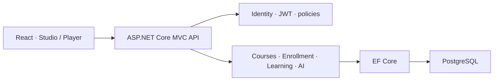

# DiwyLearn — Interactive Learning Platform

### Course authoring, active learning, and review workflows built with .NET and React

[](https://dotnet.microsoft.com/) [](https://learn.microsoft.com/ef/core/) [](https://react.dev/) [](https://www.postgresql.org/)

DiwyLearn lets one account learn, create, and manage courses. A modular Course Studio connects to a student player that persists progress, drafts, submissions, and review evidence.

> This case study documents a private product. Public samples are independently written and contain no student data, proprietary course content, or production configuration.

## The problem

Many learning platforms separate learners from creators and reduce progress to page completion. DiwyLearn models course structure and interactive blocks while enforcing role, ownership, publication, and enrollment rules on the server.

## My role

I built the product end to end: product flows, ASP.NET Core API, Identity/JWT, EF Core model and migrations, course authorization, React Course Studio/player, data hardening, and performance-oriented SQL projections.

## Engineering highlights

- ASP.NET Core Identity and JWT Bearer authentication.
- Roles: `Student`, `Creator`, and `Admin`.
- Ownership authorization for draft editing and submission review.
- Vertical slices with explicit Request/Response contracts.
- EF Core + PostgreSQL with ten primary migrations.
- Server-side rich-text sanitization and sandboxed embeds.
- Rate limits for authentication, AI generation, and access-code redemption.
- SQL projections for catalogs and progress instead of loading full graphs.
- Shared React learning-block renderers for creator preview and student player.

## Architecture



Read [architecture](./docs/architecture.md), [decisions](./docs/decisions.md), and [engineering evidence](./docs/engineering-evidence.md).

## Public code samples

| Sample | Demonstrates |
| --- | --- |
| `CourseAccessPolicy` | Role + ownership + publication rules |
| `CourseCatalogQuery` | EF Core projection, no-tracking reads, pagination |
| `CoursesController` | Thin MVC controller and explicit HTTP results |
| xUnit tests | Authorization and query behavior |

```bash
dotnet test tests/DiwyLearn.PublicSample.Tests.csproj
```

## Verified engineering evidence

- Course progress is calculated from persisted data and projected by the server.
- Long activities distinguish pending, saved draft, and submitted states.
- Creator review summarizes learners, completion, and recent submissions.
- Shared block rendering reduces drift between author preview and learner view.

## Challenges addressed

1. Keeping creator preview and student rendering consistent.
2. Preserving partial answers without presenting drafts as submissions.
3. Avoiding client-only authorization and client-invented progress.
4. Sanitizing creator/AI content before persistence.
5. Querying course summaries without loading complete content trees.

## Boundaries and demo

The private repository contains product source, data migrations, and course content. This repository contains only sanitized documentation, samples, and tests. A demo will use synthetic courses and accounts.

## License

MIT applies only to this public sample.
