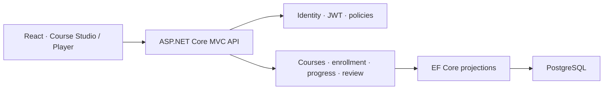

# DiwyLearn — Interactive Learning Platform

### Course authoring, active learning, and review workflows built with .NET and React

[](https://dotnet.microsoft.com/) [](https://learn.microsoft.com/ef/core/) [](https://react.dev/) [](https://www.postgresql.org/)
[](https://github.com/Johan-Alvarez-Dev/diwylearn-case-study/actions/workflows/ci.yml)

DiwyLearn lets one account learn, create, and manage courses. A modular Course Studio connects to a student player that persists progress, drafts, submissions, and review evidence.

> This case study documents a private product. The runnable API in this repository is independently written and contains no student data, proprietary course content, or production configuration.

[Run the sample](#run-the-public-sample) · [Review the code](#what-you-can-evaluate) · [Architecture](./docs/architecture.md) · [Decisions](./docs/decisions.md) · [API contract](./api/openapi.yaml)

## The product problem

Many learning platforms separate learners from creators and reduce progress to page completion. DiwyLearn models structured, interactive learning while enforcing role, ownership, publication, and enrollment rules on the server.

## My responsibility

I built the product end to end: product flows, ASP.NET Core API, Identity/JWT, EF Core model and migrations, course authorization, React Course Studio/player, data hardening, and performance-oriented SQL projections.

## What you can evaluate

This repository includes a small but complete ASP.NET Core MVC API—not disconnected snippets.

| Evidence | Engineering skill demonstrated |
| --- | --- |
| [Program.cs](./sample-code/Program.cs) | Dependency injection, middleware ordering, JWT authentication, OpenAPI |
| [CourseCatalogQuery.cs](./sample-code/CourseCatalogQuery.cs) | EF Core modeling, no-tracking projection, pagination, aggregate SQL |
| [CreatorCoursesController.cs](./sample-code/CreatorCoursesController.cs) | Role-protected MVC endpoint, validation, conflicts, explicit HTTP results |
| [CourseAccessPolicy.cs](./sample-code/CourseAccessPolicy.cs) | Testable role, ownership, publication, and enrollment rules |
| [SampleData.cs](./sample-code/SampleData.cs) | Deterministic local setup with synthetic data |
| [PublicApiTests.cs](./tests/PublicApiTests.cs) | API integration tests against real SQLite behavior |
| [Focused unit tests](./tests) | Authorization and EF Core query boundary cases |

The sample currently contains **8 passing tests** and starts with a local SQLite database, seeded courses, generated OpenAPI, a public catalog route, and a JWT-protected creator route.

## Run the public sample

Requirements: [.NET 10 SDK](https://dotnet.microsoft.com/download/dotnet/10.0). No external database, API key, or committed signing secret is required.

```bash
git clone https://github.com/Johan-Alvarez-Dev/diwylearn-case-study.git
cd diwylearn-case-study
dotnet test tests/DiwyLearn.PublicSample.Tests.csproj
dotnet run --project sample-code/DiwyLearn.PublicSample.csproj
```

In a second terminal:

```bash
curl http://localhost:5054/api/public/courses
curl http://localhost:5054/openapi/v1.json
```

Create a short-lived local JWT with the official .NET development tool. The signing key remains in local user secrets and is never committed.

```bash
TOKEN=$(dotnet user-jwts create \
  --project sample-code/DiwyLearn.PublicSample.csproj \
  --name recruiter \
  --role Creator \
  --valid-for 1h \
  --output token)

curl -X POST http://localhost:5054/api/creator/courses \
  -H "Authorization: Bearer $TOKEN" \
  -H "Content-Type: application/json" \
  -d '{"title":"Secure APIs","slug":"secure-apis"}'
```

## Production architecture



The public sample replaces PostgreSQL with SQLite to keep review friction low; the authorization and query boundaries remain representative. Read the full [architecture](./docs/architecture.md), [technical decisions](./docs/decisions.md), and [engineering evidence](./docs/engineering-evidence.md).

## Engineering highlights

- ASP.NET Core Identity and JWT Bearer authentication.
- `Student`, `Creator`, and `Admin` roles with server-side ownership checks.
- Vertical slices with explicit request and response contracts.
- EF Core + PostgreSQL with ten primary migrations in the private product.
- Server-side rich-text sanitization and sandboxed embeds.
- Rate limits for authentication, AI generation, and access-code redemption.
- SQL projections for catalogs and progress instead of loading full graphs.
- Shared React learning-block renderers for creator preview and student player.

## Challenges solved

1. Keeping creator preview and student rendering consistent.
2. Preserving partial answers without presenting drafts as submissions.
3. Preventing client-only authorization and client-invented progress.
4. Sanitizing creator and AI-assisted content before persistence.
5. Querying course summaries without loading complete content trees.

## Public and private boundary

| Public in this repository | Kept private |
| --- | --- |
| Runnable reduced API and synthetic seed data | Production application source |
| Authorization and EF Core samples | Student data and course content |
| Unit and integration tests | Production configuration and secrets |
| Reduced OpenAPI contract and architecture | Complete schemas and operational endpoints |

The production product remains private because it is actively developed. This public case study is intentionally executable so reviewers can evaluate the engineering practices directly.

## License

MIT applies only to the public sample. See [LICENSE](./LICENSE) and [SECURITY.md](./SECURITY.md).
