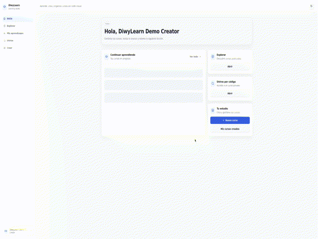
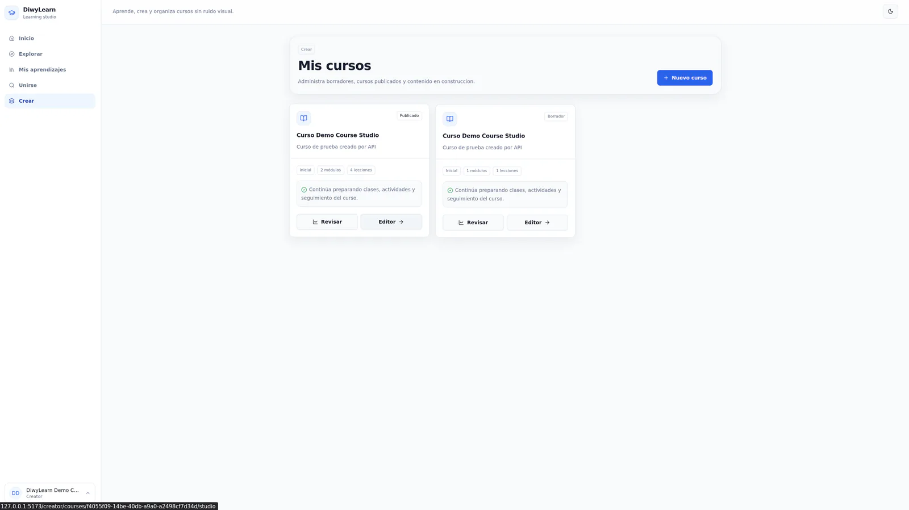
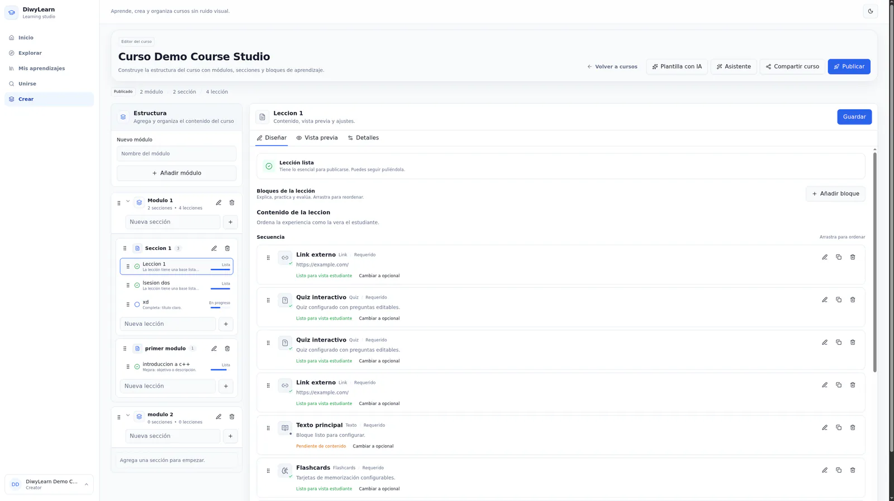
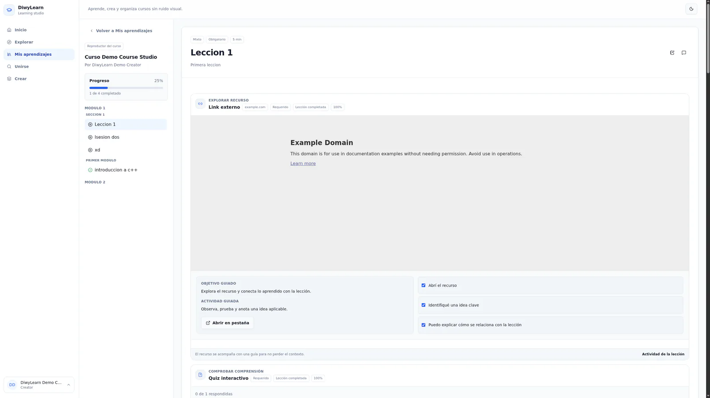
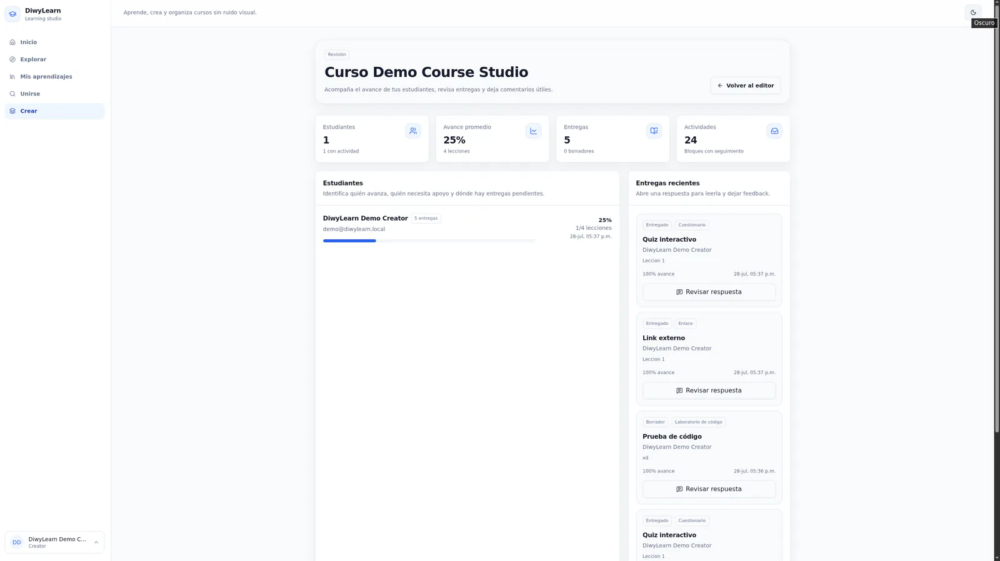
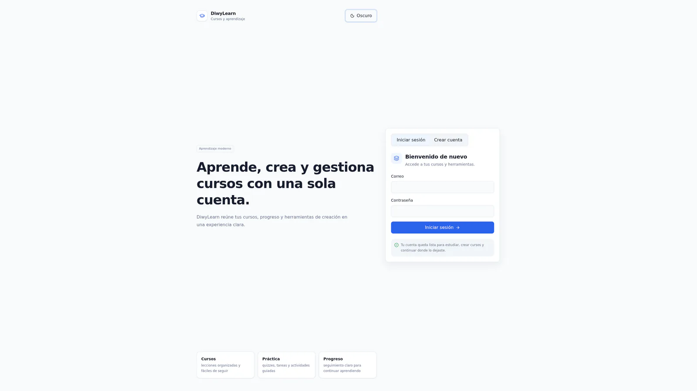

# DiwyLearn product tour

These captures use synthetic courses and demo accounts. Theme-aware views switch automatically where both light and dark variants are available. Open the [live demo](https://learn.diwy.online/demo) or use the [product documentation](https://guide.diwy.online/) for a guided experience.

## Quick walkthrough

The silent preview follows the creator dashboard, learning access flow, course library, and structured Course Studio.

  

## Course Studio

Creators manage published courses and drafts from a focused studio rather than mixing authoring controls into the learner experience.

<picture>
  <source media="(prefers-color-scheme: dark)" srcset="../screenshots/diwylearn-studio-900.webp 900w, ../screenshots/diwylearn-studio-1600.webp 1600w">
  <source media="(prefers-color-scheme: light)" srcset="../screenshots/diwylearn-studio-light-900.webp 900w, ../screenshots/diwylearn-studio-light-1600.webp 1600w">
  
</picture>

## Structured course editor

Modules, sections, lessons, and interactive blocks are organized in one authoring hierarchy with explicit readiness states.

<picture>
  <source media="(max-width: 900px)" srcset="../screenshots/diwylearn-editor-light-900.webp">
  
</picture>

## Learner experience

The player persists progress while keeping resources, guided activities, and comprehension checks in context.

<picture>
  <source media="(max-width: 900px)" srcset="../screenshots/diwylearn-lesson-light-900.webp">
  
</picture>

## Review workflow

Creators can inspect completion, submissions, and activity evidence without exposing authoring controls to learners.

<picture>
  <source media="(prefers-color-scheme: dark)" srcset="../screenshots/diwylearn-review-dark-900.webp 900w, ../screenshots/diwylearn-review-dark-1600.webp 1600w">
  <source media="(prefers-color-scheme: light)" srcset="../screenshots/diwylearn-review-light-900.webp 900w, ../screenshots/diwylearn-review-light-1600.webp 1600w">
  
</picture>

## Authentication

The sign-in flow is isolated from course content and establishes the server-side role boundary.

<picture>
  <source media="(prefers-color-scheme: dark)" srcset="../screenshots/diwylearn-login-900.webp 900w, ../screenshots/diwylearn-login-1600.webp 1600w">
  <source media="(prefers-color-scheme: light)" srcset="../screenshots/diwylearn-login-light-900.webp 900w, ../screenshots/diwylearn-login-light-1600.webp 1600w">
  
</picture>

Return to the [case study](../README.md) or review the [architecture](./architecture.md).
